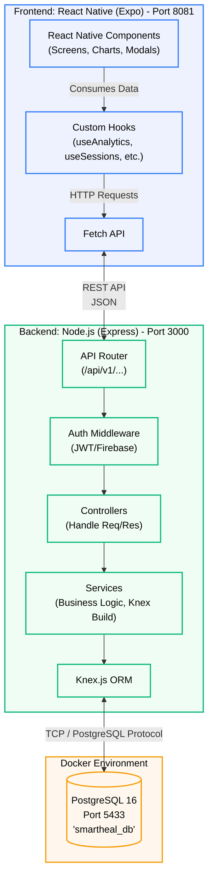

# Architecture & Data Flow Diagrams

## Current Architecture (Node.js + Docker + React Native)

The stack has transitioned from API to a custom Node.js API with a containerized PostgreSQL database.



## Data Flow Pipeline

1. **User Request**: The user opens the Analytics or Session view in the Expo App.
2. **Hook Trigger**: `useAnalytics.ts` or `useSessions.ts` fires a `fetch()` request containing a Bearer token (`mock-token-dev` in development).
3. **API Routing**: The Express Router (`backend/src/routes/`) catches the request on `http://localhost:3000/api/v1/*`.
4. **Middleware**: `auth.js` middleware validates the token.
5. **Controller & Service**: The route controller delegates to a Service file (like `analyticsService.js`).
6. **Query Construction**: The service utilizes `Knex.js` with PostgreSQL-compatible syntax (e.g., `NOW() - INTERVAL '30 days'`) to formulate the SQL query.
7. **Database Execution**: Knex sends the query to the **Dockerized PostgreSQL** container on `127.0.0.1:5433`.
8. **Response Return**: The DB returns rows, Knex formats them into a JS object, the Service returns it to the Controller, the Controller replies via JSON, and the React frontend updates its state (`useState`), re-rendering the UI.

---

## Data Structure Hierarchy

```
┌──────────────────────────────────────────────────────┐
│           POSTGRESQL BACKEND TABLES                   │
├──────────────────────────────────────────────────────┤
│                                                       │
│  ┌─────────────────────────────────────────────┐    │
│  │ PROFILES (Therapists, Admins)               │    │
│  │ ├─ id (UUID)                                │    │
│  │ ├─ email, full_name                         │    │
│  │ ├─ role (admin|therapist|support)           │    │
│  │ └─ avatar_url, timestamps                   │    │
│  └─────────────────────────────────────────────┘    │
│           ↑              ↑              ↑            │
│         owns          assigns        manages         │
│           │              │              │            │
│  ┌─────────────────────────────────────────────┐    │
│  │ CLIENTS (Patients)                          │    │
│  │ ├─ id, name, email, phone                   │    │
│  │ ├─ progress (0-100)%, adherence (%)         │    │
│  │ ├─ status (Active|Inactive)                 │    │
│  │ ├─ profile_type (Orthopedic|Cardiac|...)    │    │
│  │ ├─ therapist_id (FK)                        │    │
│  │ ├─ last_active, change (trend)              │    │
│  │ └─ sessions (count)                         │    │
│  └─────────────────────────────────────────────┘    │
│           ↓ receives                                 │
│                                                      │
│  ┌─────────────────────────────────────────────┐    │
│  │ SESSIONS (Therapy Sessions)                 │    │
│  │ ├─ id, client_id (FK), therapist_id (FK)    │    │
│  │ ├─ therapy_type (EMS|Ultrasound|...)        │    │
│  │ ├─ date, time, duration                     │    │
│  │ ├─ status (Completed|Scheduled|...)         │    │
│  │ ├─ progress (0-100)%                        │    │
│  │ └─ notes                                     │    │
│  └─────────────────────────────────────────────┘    │
│           ↓                                          │
│  ┌─────────────────────────────────────────────┐    │
│  │ QUERIES (Support Tickets)                   │    │
│  │ ├─ id, title, description                   │    │
│  │ ├─ client_id (FK), assigned_to (FK)         │    │
│  │ ├─ priority (Critical|High|Medium|Low)      │    │
│  │ ├─ status (New|Open|In Progress|Closed)     │    │
│  │ └─ device_info, support_id                  │    │
│  └─────────────────────────────────────────────┘    │
│           ↓ has responses                           │
│  ┌─────────────────────────────────────────────┐    │
│  │ QUERY_RESPONSES (Ticket Comments)           │    │
│  │ ├─ id, query_id (FK), message               │    │
│  │ ├─ author, is_staff                         │    │
│  │ └─ created_at                               │    │
│  └─────────────────────────────────────────────┘    │
│                                                      │
│  ┌─────────────────────────────────────────────┐    │
│  │ DEVICES (Medical Equipment)                 │    │
│  │ ├─ id, name, type                           │    │
│  │ ├─ status (Connected|Standby|Offline)       │    │
│  │ ├─ battery_level, last_sync                 │    │
│  │ └─ firmware_version                         │    │
│  └─────────────────────────────────────────────┘    │
│                                                      │
│  ┌─────────────────────────────────────────────┐    │
│  │ MESSAGES (Communications)                   │    │
│  │ ├─ id, sender_id (FK), receiver_id (FK)     │    │
│  │ ├─ content, read                            │    │
│  │ ├─ attachments                              │    │
│  │ └─ created_at, updated_at                   │    │
│  └─────────────────────────────────────────────┘    │
│                                                      │
│  ┌─────────────────────────────────────────────┐    │
│  │ ANALYTICS_EVENTS (Event Tracking)           │    │
│  │ ├─ id, event_type (login|signup)            │    │
│  │ ├─ user_id (FK)                             │    │
│  │ └─ created_at                               │    │
│  └─────────────────────────────────────────────┘    │
│                                                      │
└──────────────────────────────────────────────────────┘
```

---

## Data Flow: From Database to Screen

```
┌─────────────────────────────────────────────────────────────┐
│                    NODE.JS API + POSTGRES                    │
│  Tables: profiles, clients, sessions, queries, devices...   │
└─────────────────────────────────────────────────────────────┘
                           ↓
        ┌─────────────────────────────────────┐
        │             Express/Knex.js         │
        │    (REST API & Backend Services)    │
        └─────────────────────────────────────┘
                           ↓
┌─────────────────────────────────────────────────────────────┐
│                    REACT HOOKS LAYER                         │
├─────────────────────────────────────────────────────────────┤
│                                                              │
│  useClients()          useSessions()        useDevices()    │
│  ├─ clients[]          ├─ sessions[]        ├─ devices[]    │
│  ├─ stats              ├─ stats             ├─ stats        │
│  └─ methods            └─ methods           └─ methods      │
│     (CRUD+search)         (CRUD+filter)        (CRUD)       │
│                                                              │
│  useAnalytics()        useDashboard()      useQueries()    │
│  ├─ clientStats        ├─ stats (KPI)      ├─ queries[]    │
│  ├─ sessionStats       ├─ monthlyData      ├─ responses[]  │
│  ├─ chartData          ├─ recentClients    └─ stats        │
│  ├─ riskClients        └─ todaysSchedule                   │
│  └─ therapistPerf                                          │
│                                                              │
│  useMessages()         useNotifications()  useResponsive()  │
│  ├─ contacts[]         ├─ notifications[]  ├─ isMobile     │
│  ├─ messages[]         ├─ unreadCount      ├─ isDesktop    │
│  └─ methods            └─ methods          └─ columns      │
│                                                              │
└─────────────────────────────────────────────────────────────┘
                           ↓
              (State setters + computed values)
                           ↓
┌─────────────────────────────────────────────────────────────┐
│               SCREEN COMPONENTS LAYER                        │
├─────────────────────────────────────────────────────────────┤
│                                                              │
│  DashboardScreen              AnalyticsScreen              │
│  ├─ Fallback to DEMO data    ├─ Charts (pie, bar, line)   │
│  ├─ StatCards (4 KPIs)       ├─ StatCards (4 metrics)     │
│  ├─ BarChart                 ├─ Performance summary       │
│  ├─ Schedule list            └─ Export button             │
│  └─ Recent clients table                                   │
│                                                              │
│  ClientManagementScreen       SessionHistoryScreen         │
│  ├─ Client grid/cards        ├─ Filter tabs               │
│  ├─ Search bar               ├─ Session cards             │
│  ├─ StatCards                ├─ Priority badges           │
│  ├─ CRUD modal               ├─ Export button             │
│  └─ Avatar + Progress bars   └─ Add session modal         │
│                                                              │
│  DeviceControlsScreen         QueryManagementScreen        │
│  ├─ Device cards             ├─ Query list                │
│  ├─ Connection status        ├─ Priority grouping         │
│  ├─ Battery levels           ├─ Response threads          │
│  └─ Update modal             └─ Create ticket modal       │
│                                                              │
└─────────────────────────────────────────────────────────────┘
                           ↓
┌─────────────────────────────────────────────────────────────┐
│              PRESENTATION LAYER (UI Components)              │
├─────────────────────────────────────────────────────────────┤
│                                                              │
│  Cards & Containers: Card, StatCard, Badge, Avatar         │
│  Charts: BarChart, LineChart, PieChart                      │
│  Inputs: Input, SearchBar, FilterTabs, Modal               │
│  Feedback: ProgressBar, NotificationPanel, EmptyState      │
│  Navigation: Sidebar, Header, Button                        │
│                                                              │
└─────────────────────────────────────────────────────────────┘
```

---

## Analytics Calculation Pipeline

```
┌─────────────────────────────────────────────────────┐
│            Raw Data Tables                           │
│  clients[] (12), sessions[] (25), profiles[] (4)    │
└─────────────────────────────────────────────────────┘
                      ↓
         ┌────────────────────────────┐
         │  CALCULATION FUNCTIONS      │
         │  (lib/analytics.ts)         │
         └────────────────────────────┘
             ↙  ↓  ↓  ↓  ↓  ↓  ↓  ↘

  ┌──────────────────────────────────────────────────┐
  │                                                   │
  │  calculateClientStats()                          │
  │  └─→ {total, active, inactive, avgProg,         │
  │       avgAdherence, byProfileType}              │
  │                                                   │
  │  calculateSessionStats()                         │
  │  └─→ {total, completed, scheduled, cancelled,  │
  │       completionRate, avgProgress}             │
  │                                                   │
  │  calculateTherapyOutcomes()                      │
  │  └─→ [{therapyType, avgProgress, sessionsCount, │
  │       successRate}, ...]                        │
  │                                                   │
  │  calculateTherapistPerformance()                 │
  │  └─→ [{therapistName, clientsCount,            │
  │       completedSessions, avgProg}, ...]        │
  │       SORTED by completedSessions DESC          │
  │                                                   │
  │  calculateMonthlyGrowth()                        │
  │  └─→ [{month, activeClients, completedSessions,│
  │       newClients}, ...]                        │
  │                                                   │
  │  identifyRiskClients()                           │
  │  └─→ [{clientName, riskLevel (high|med|low),   │
  │       reasons[], lastActive}, ...]             │
  │       FILTERED to riskLevel != 'low'            │
  │       SORTED by (HIGH, MEDIUM)                  │
  │                                                   │
  │  calculateDeviceStats()                          │
  │  └─→ {total, connected, standby, offline,      │
  │       connectionRate}                           │
  │                                                   │
  └──────────────────────────────────────────────────┘
                      ↓
         ┌────────────────────────────┐
         │  Transform for Display       │
         │  (Chart formats)            │
         └────────────────────────────┘
             ↙  ↓  ↓  ↓  ↓  ↘

  ┌──────────────────────────────────────────────────┐
  │                                                   │
  │  clientDistribution (Pie Chart)                  │
  │  [{label, value, color}, ...]                   │
  │                                                   │
  │  sessionTrends (Bar Chart)                       │
  │  [{label, values: [{value, color, label}]}]    │
  │                                                   │
  │  therapyOutcomes (Bar Chart)                     │
  │  [{label, values: [{value, color}]}]           │
  │                                                   │
  │  growthData (Line Chart)                         │
  │  [{label, values: [{value, color, label}]}]    │
  │                                                   │
  └──────────────────────────────────────────────────┘
                      ↓
         Display in AnalyticsScreen
```

---

## Risk Scoring Decision Tree

```
START: for each client
  ↓
  IF adherence < 50%?
    YES → reasons += "Low adherence"
          riskLevel = HIGH ──┐
    NO → adherence < 70%?   │
           YES → reasons += "Moderate adherence"
                 riskLevel = MEDIUM
           NO → continue
                ↓
  IF progress < 30%?
    YES → reasons += "Minimal progress"
          riskLevel = HIGH ──┐
    NO → progress < 50%?    │
           YES → reasons += "Low progress"
                 riskLevel = MEDIUM (if not HIGH already)
           NO → continue
                ↓
  IF status == 'Inactive'?
    YES → reasons += "Inactive status"
          riskLevel = HIGH ──┐
    NO → last_active == 'Never'?
           YES → reasons += "Never attended"
                 riskLevel = HIGH
           NO → continue
                ↓
  IF change < -3%?
    YES → reasons += "Declining trend"
          riskLevel = MEDIUM (if not HIGH already)
    NO → continue
         ↓
  FILTER OUT: riskLevel == 'low'
  SORT BY: (HIGH, MEDIUM)
  ↓
RETURN: At-risk clients list
```

---

## Real-time Update Flow

```
USER ACTION
  ↓
  │ (e.g., update client status)
  ↓
PUT request to Node API
  ↓
Database UPDATE
  ↓
Postgres notifies subscribers
  ↓
┌─────────────────────────────────────┐
│ Hook receives changes                │
│ useClients() subscription            │
│ .on('postgres_changes', ...)        │
└─────────────────────────────────────┘
  ↓
setState(newData)
  ↓
Component re-renders with fresh data
  ↓
UI updates in real-time
  ↓
All users see the same data instantly
```

---

## Screen Data Requirements

```
DASHBOARD SCREEN
├─ useDashboard()
│  ├─ get_dashboard_stats RPC
│  ├─ monthly_sessions RPC
│  ├─ recent clients (5)
│  └─ today's schedule
├─ useDashboard fallback calculation
│  └─ Count clients, sessions, devices
└─ Output: 4 KPI cards + chart + schedule

ANALYTICS SCREEN
├─ useAnalytics()
│  ├─ All clients
│  ├─ All sessions
│  ├─ All therapists
│  └─ Analytics events
├─ Calculate all metrics in lib/analytics.ts
│  ├─ Client stats
│  ├─ Session stats
│  ├─ Therapy outcomes
│  ├─ Therapist performance
│  ├─ Monthly growth
│  └─ Risk clients
├─ Transform to chart formats
└─ Output: 4 stat cards + 4 charts + performance box

CLIENT MANAGEMENT
├─ useClients()
│  ├─ Fetch all clients
│  ├─ Real-time subscription
│  ├─ Search capability
│  └─ CRUD methods
├─ Compute stats (total, active, avgProgress, avgAdherence)
├─ Layout responsive grid
└─ Output: Grid of client cards with details

SESSION HISTORY
├─ useSessions()
│  ├─ Fetch all sessions
│  ├─ Real-time subscription
│  ├─ Filter by status
│  └─ CRUD methods
├─ Compute stats (total, completed, scheduled, cancelled)
├─ Calculate priority from progress
├─ Map therapy_type to client name
└─ Output: List of session cards with priority

DEVICE CONTROLS
├─ useDevices()
│  ├─ Fetch all devices
│  ├─ Real-time subscription
│  └─ Update methods
├─ Compute stats (connected, standby, offline, rate)
└─ Output: Device cards with status indicators

QUERY MANAGEMENT
├─ useQueries()
│  ├─ Fetch queries + responses
│  ├─ Real-time subscription
│  └─ CRUD methods
├─ Group by priority & status
├─ Fetch responses for each query
└─ Output: Query cards with response threads
```

---

## Component Integration Pyramid

```
                    SCREENS
         (DashboardScreen, Analytics, etc)
                      ▲
                      │ uses
                      │
                    UI COMPONENTS
        (StatCard, Card, Charts, Modal, etc)
                      ▲
                      │ uses
                      │
                    HOOKS
    (useClients, useSessions, useAnalytics, etc)
                      ▲
                      │ calls
                      │
                   POSTGRESQL API
    ┌─────────────────────────────────────┐
    │  Database Tables                     │
    │  Real-time Subscriptions             │
    │  RPC Functions (get_dashboard_stats) │
    └─────────────────────────────────────┘


DATA TRANSFORMATION PATH:
Raw DB → Hook (fetch + compute) → Screen (format) → UI (render)
```

---

## Authentication & Authorization Flow

```
START
  ↓
┌─────────────────────────────────────────┐
│       AuthProvider (lib/auth.tsx)        │
├─────────────────────────────────────────┤
│ • Wraps entire app                       │
│ • Manages JWT session               │
│ • On auth state change → fetch profile  │
└─────────────────────────────────────────┘
  ↓
  IF user logged in?
    YES → app/(app) layout
          ├─ Sidebar (routes: dashboard, analytics, etc)
          └─ Main content area
    NO → app/(auth)/login
          ├─ OAuth options (Google, GitHub)
          ├─ Demo login (admin@smartheal.io)
          └─ Demo redirect
  ↓
useAuth() hook available to all screens
  ├─ user: Logged-in user object
  ├─ profile: User's profile (from DB)
  ├─ session: Active session
  └─ methods: signIn, signOut, etc
```

---

## State Management Pattern

```
Hook receives data from API
  ↓
useState() manages local state
  ↓
useEffect() fetches on mount + real-time subscription
  ↓
useCallback() memoizes CRUD operations
  ↓
Return { data, loading, error, methods }
  ↓
Component receives props from hook
  ↓
setState changes trigger re-renders
  ↓
UI reflects latest data


REAL-TIME PATTERN:
Initial fetch
  ↓
Subscribe to changes
  ↓
Receive notification (INSERT, UPDATE, DELETE)
  ↓
Call fetchData() or update local state
  ↓
Trigger re-render
  ↓
User sees live updates
```

---

## Key Metrics Calculation Reference

| Metric          | Formula                                         | Source                    | Use Case                       |
| --------------- | ----------------------------------------------- | ------------------------- | ------------------------------ |
| Client Progress | Individual % or Average of all                  | Client.progress           | Track patient recovery         |
| Adherence Rate  | Sessions attended / Sessions prescribed         | Client.adherence          | Identify disengaged clients    |
| Completion Rate | Completed session / Total sessions              | Session status counts     | Track program success          |
| Success Rate    | Sessions with progress > 70% / completed        | Session.progress > 70%    | Measure therapy effectiveness  |
| Connection Rate | (Connected + Standby) / Total devices × 100     | Device.status             | Monitor equipment availability |
| Avg Performance | Team metric aggregation                         | Multiple clients/sessions | Therapist rankings             |
| Risk Score      | Composite of adherence, progress, status, trend | Client fields             | Identify at-risk clients       |
